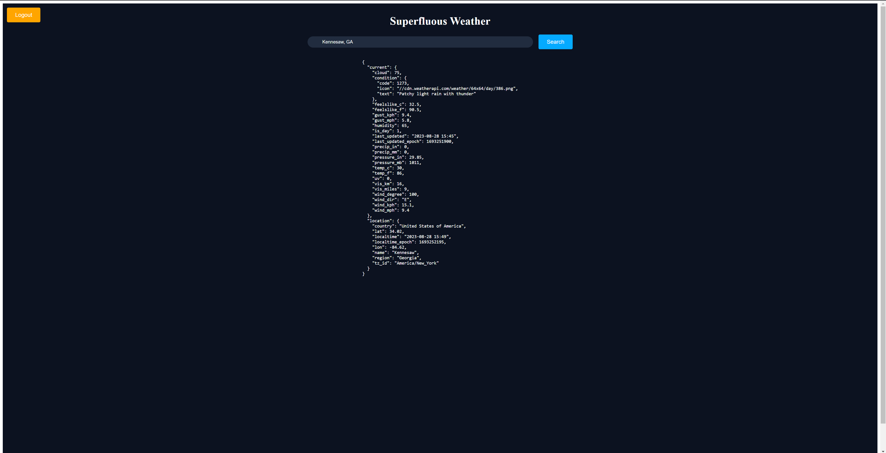

# **Superfluous Weather**

**Table of Contents**

1. Introduction
2. Features
3. Technologies Used
4. Getting Started
  1. Prerequisites
  2. Installation
5. Usage
6. Future Plans

**Introduction**

Welcome to Superfluous Weather, a multifaceted weather application designed as a learning sandbox for advanced software development and project management techniques. While this application isn't designed to be production-ready, it serves as a platform for me to explore various technologies and methodologies as a student software engineer.

This project was born out of a passion for learning new complex systems and features a range of components, such as user authentication, real-time weather data fetching via APIs, and cache databases to optimize performance. Under the hood, the application leverages a stack of carefully selected technologies, including MongoDB, Postgres, Golang, HTML, CSS, and JavaScript. To manage the orchestration of various services, Kubernetes deployments and Docker containers are extensively used.

Upcoming features and project enhancements for Superfluous Weather include the integration of a CI/CD pipeline and automated load testing capabilities using Apache JMeter.

**Features**

- User Login
- Weather API Implementation
- Cache Databases

**Technologies Used**

- MongoDB
- Postgres
- GOLANG
- HTML, CSS, Javascript
- Kubernetes Deployments
- Docker Containers

**Getting Started**

**Prerequisites**

While this project is available and hosted online you can easily run this locally on your machine. Before downloading and running please ensure that you have Docker open with Kubernetes installed. Minikube and Kubectl are also required as they allow for local node management.

**Installation**

To run the software and all of its required resources please open a terminal and navigate to the folder inside this project labelled 'k8s'. Once in that folder run the following commands. 'Minikube start' to get the node running on your local machine. 'kubectl apply -f .' to apply all services and deployments inside the k8s folder. Assuming all is well you can then type 'minikube service super-weather' to open the front end website in your browser and interact with the system.

**Usage**

To use the system please create or login to your account. Once in there you can search for locations across the world and get JSON data displayed to you on screen. The cache database includes a time to live (TTL) feature that will cache the JSON response for 5 minutes. You should notice a significant decrease in response time if the location you were searching for is in the cache database.

**Future Plans**

- CI/CD pipeline
- Automated load testing using
